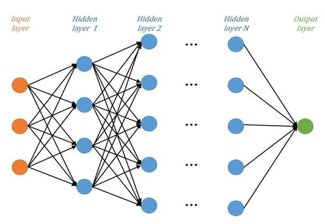
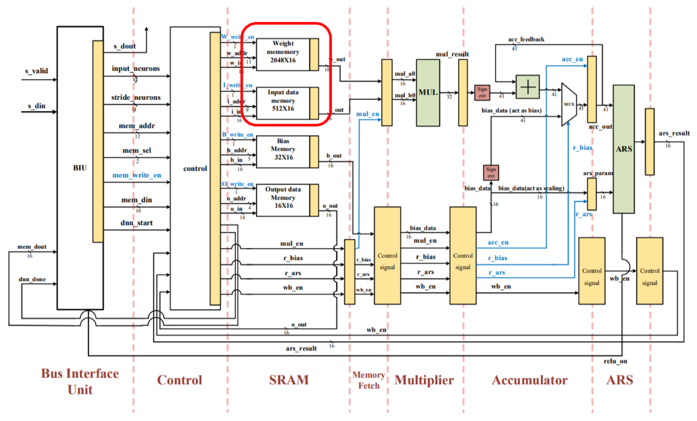
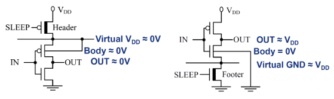
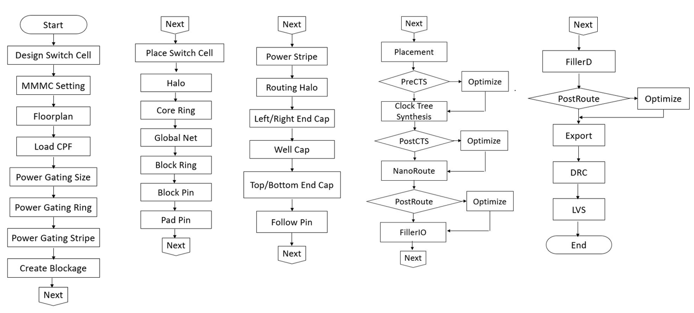
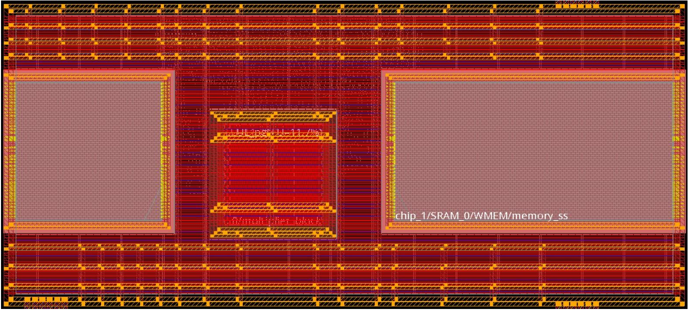

# Deep Neural Network Accelerator with Power Gating

## Table of Contents
- [Overview](#overview)
- [DNN Circuit Architecture](#dnn-circuit-architecture)
- [Power Gating Design](#power-gating-design)
- [Design Flow](#design-flow)
- [Implementation Status](#implementation-status)
- [Layout](#layout)

&nbsp;

## Overview

### Project Objective

To reduce the leakage power of DNN circuits, this project incorporates **Power Gating** into the design. Power Gating is applied to the multiplier blocks within the DNN accelerator. By adding Power Gating to the DNN circuit, the impact of Power Gating on circuit performance can be analyzed, helping to understand its effectiveness in reducing power consumption.

### Brief introduction of power gating

Power Gating is a power management technique that reduces leakage power by shutting off power supply to inactive circuit blocks. This is achieved by inserting power switches (header or footer transistors) between the power supply and the circuit, effectively cutting off the supply voltage when the circuit is in sleep mode.

### Key Benefits

- ✅ **Leakage Power Reduction**: Significantly reduces static power consumption in idle states
- ✅ **Energy Efficiency**: Improves overall power efficiency of DNN accelerators
- ✅ **Performance Analysis**: Provides insights into power-performance trade-offs

&nbsp;

## DNN Circuit Architecture

### Part1. Deep Neural Network (DNN) Overview

<div align="center">
  
  <p><i>Figure: Deep Neural Network Structure</i></p>
</div>

**Deep Neural Network (DNN)** is a machine learning model composed of multiple interconnected layers. A DNN typically consists of:

- **Input Layer**: Receives input data
- **Hidden Layers**: Multiple layers that perform feature extraction and transformation
- **Output Layer**: Produces final predictions

Each neuron in a layer is connected to neurons in the adjacent layers. During the forward propagation process, data flows from the input layer through the hidden layers to the output layer. Each neuron receives weighted inputs, applies an activation function (such as ReLU or Sigmoid), and passes the result to the next layer.

**Training Process**: The network adjusts weights and biases through backpropagation and gradient descent to minimize the loss between predictions and actual results.

---

### Part2. Detailed DNN Accelerator Architecture

<div align="center">
  
  <p><i>Figure: Detailed DNN Accelerator Architecture</i></p>
</div>

The detailed architecture includes the following key modules:

| Module | Sub-Component | Function |
|--------|---------------|----------|
| **Bus Interface Unit** | - | Manages external communication and data transfer |
| **Control Unit** | - | Acts as the control center, managing the entire SRAM read/write process |
| **SRAM Module** | Weight Memory | Stores neural network weights |
| | Input Data Memory | Stores input neuron values |
| | Bias Memory | Stores bias parameters |
| | Output Data Memory | Stores computation results |
| **Memory Fetch** | - | Fetches data from each memory module |
| **Multiplier** | - | Performs multiply-accumulate (MAC) operations on the fetched data |
| **Accumulator** | - | Accumulates the products to compute the weighted sum for each neuron |
| **ARS** | - | Applies activation functions and stores final results back to memory |

---

### SRAM Macro Replacement

In this design, we replaced the original **flip-flop arrays** for weight and input data storage with **actual SRAM macros**:

&nbsp;

## Power Gating Design

### Part1. Load Current Calculation

To implement Power Gating effectively, we first need to determine the **load current** of the circuit. The load current is calculated as follows:
```
Total Power = V_supply × I_circuit
```

**Calculation Steps**:
1. Obtain **Total Power** from Design Compiler's Power Report
2. Extract **Multiplier Block** power consumption
3. Calculate load current: `I_circuit = Total Power / V_supply`
4. Use **Hspice** to simulate and verify the Power Gating Cell sizing
5. Ensure VCCV maintains **VCCR ≥ 97%** under load conditions

**Purpose**: Accurate load current calculation ensures proper sizing of power switches to minimize voltage drop and performance degradation.

---

### Part2. Header vs Footer: Design Choice

Power Gating can be implemented using two methods: **Header** (PMOS) or **Footer** (NMOS) switches.

<div align="center">
  
  <p><i>Figure: Header and Footer Power Switch Comparison</i></p>
</div>

#### **Coarse Grain Footer (NMOS)**
- Uses **NMOS transistors** as power switches
- Creates a **Virtual GND ≈ V_DD** when in SLEEP mode
- Body voltage is 0V in SLEEP mode

#### **Coarse Grain Header (PMOS)**
- Uses **PMOS transistors** as power switches
- Creates a **Virtual V_DD = 0V** when in SLEEP mode
- Body voltage equals V_DD in SLEEP mode

#### **Our Choice: Header (PMOS) Type**

We selected the **Header design** for Power Gating in this project.

**Rationale**:
- ✅ **Better SLEEP Mode Performance**: In SLEEP mode, the body voltage is approximately 0V, resulting in **lower leakage current** compared to Footer
- ✅ **PMOS Virtual V_DD Connection**: Provides more stable virtual power rail
- ✅ **Reduced Leakage**: PMOS header configuration minimizes leakage in idle states

**Trade-off**: While Header requires PMOS devices (which are typically larger than NMOS for the same drive strength), the leakage reduction benefits outweigh the area overhead in our design.

---

### (三) Power Gating Cell Selection and Sizing

To optimize the Power Gating design, we performed **Hspice simulations** to:

1. **Select Power Gating Cell Type**: Choose appropriate header cell from the standard cell library
2. **Determine Cell Count**: Calculate the number of parallel power switches needed
3. **Verify Voltage Drop**: Ensure virtual VCCV meets the VCCR ≥ 97% requirement
4. **Validate Performance**: Confirm acceptable delay overhead

&nbsp;

## Design Flow

<div align="center">
  
  <p><i>Figure: Complete Design Flow from RTL to Layout</i></p>
</div>

&nbsp;

## Implementation Status

This project has successfully passed post-layout gate-level simulation and DRC/LVS verification.

&nbsp;

## Layout

<div align="center">
  
  <p><i>Figure: Complete DNN Accelerator Layout with Power Gating</i></p>
</div>

&nbsp;


